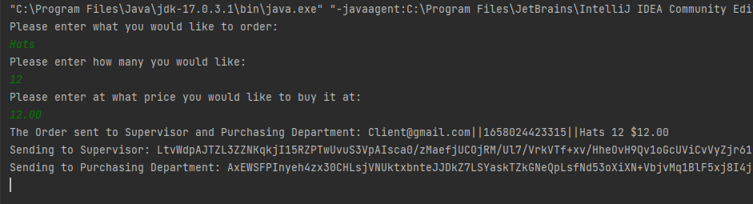
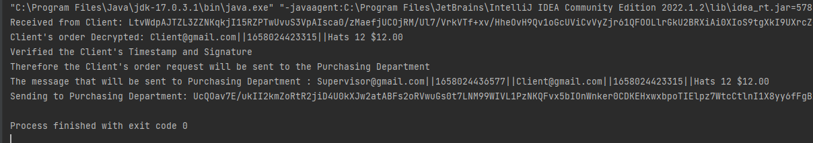
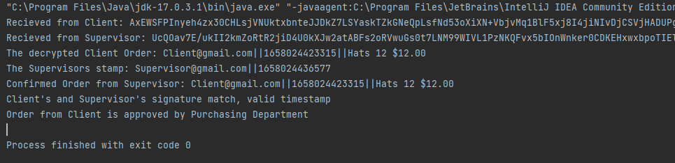

## Description
The purpose of this project was to create an email protocol using Java. This project would need servers on different ports that would need to communicate, all communication would be done safely with encryption. In the end, everyone must also be able to verify the messages. The three components of an email protocol would be the Client who wants to send a purchasing order, The Supervisor who is responsible for approving the order, and the Purchasing department who will confirm the order based on the client and supervisor. 

## How the code works
### Imports For the Project
The main libraries used for this project are java IO, security, and crypto.


### Set Up
All components share the keyExchange function which runs at the beginning of the project that distributes all the keys. This is done because the assumption is that all servers know each other's public keys beforehand. Each component stores the public keys and also creates a socket connection for the other two servers. For the actual communication Readers and Writers are set up so that the servers can communicate with each other. Each component also has its ID in the form of an email.


### Sequence
The order in which the code runs:
1. Key Exchanges were done at the start
2. The Client asks the user for the order details
3. The Client creates a message for the order with a timestamp
4. The message is then encrypted + signed and sent to both Supervisor and Purchasing Department
5. The Supervisor decrypts the message, verifies it, and checks for any replay attacks
6. Once everything is verified the supervisor approves the order
7. Supervisor then takes the order, adds a timestamp to the message, encrypts + signs the message, and sends it over to Purchasing Dept
8. The PurchaseDept decrypts the messages, verifies them, and checks for any replay attacks on either message
9. If both messages contain the same order then everything is approved and the order goes through

### Encryption, Replay Attacks, and Validation
The project dealt with encryption for secure communication, we chose to use RSA public/private encryption. We also decided we needed to verify the user sending the message therefore we signed our messages using SHA-1 Hashing with our private keys. To prevent Replay attacks, all messages are timestamped. Every component keeps track of the latest timestamp from each other, if a message comes with a time equal to or less than the previous message then it will be ignored.

Encryption and Verification Sample


Replay Attack Prevention


### Sending + String and Byte Conversion
Since we also wanted to observe how the code runs, the output of each encryption, the messages being sent, and the keys generated we decided to convert everything into a string. All object information was converted to a string including byte data, this was done using either the {getBytes() , new String()} pairing or using the base 64 encoder/decoder pairing.

For messages being encrypted the getBytes() and new String was used, this is for simplicity. When sending messages we wanted to use the base64 encoder/decoder since byte data was read using this conversion method.

Base64 sample Code
```Java
String msg = "sample";
String msgByte = Base64.getDecoder().decode(msg);
String newMsg = Base64.getEncoder().encodeToString(msgByte);
```

getBytes + new String sample code
```Java
String msg = "sample";
String msgByte = msg.getBytes();
String newMsg = new String(msgByte);
```


Data parsing on the receiving end was done using the string split() method
```Java
String msg = "Something || to || Parse";
String[] parsedArray = msg.split("\\|\\|");
```

## Results and Final Thoughts
Everything worked as it was supposed to so the results were great. The code could be cleaner since there is a lot that can be packed into even more functions for organization purposes.
If I were to restart this project then I would make a parent class for the components since they all share 80% of the same features such as encryption and signatures, socket connections, and reading/writing to each other. The total lines of code would go down as well as make it easier to read.

Output for the client:



Output for the Supervisor:



Output for the Purchasing Department:

